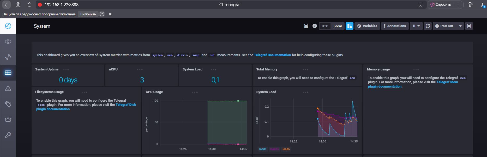

# Системы мониторинга

1. Минимальный набор метрик для мониторинга проекта:

    * Загрузка CPU — чтобы понимать, насколько сильно загружены вычисления.
    * Количество HTTP-запросов и их успешность (статусы 2xx, 4xx, 5xx) — для оценки работы сервиса.
    * Использование диска — чтобы не допустить переполнение хранилища.
    * Время отклика HTTP — чтобы знать, насколько быстро платформа отвечает клиентам.

2. Перевод метрик в бизнес показатели: SLO, SLA и SLI

3. Приложения логируют в stdout/stderr. DevOps собирает только stderr в файл. Разработчики смотрят через ssh/SCP или получают уведомления в какие-нибудь каналы нотификации.

4. Ошибка в формуле SLA: берется количество только 2xx запросов и делится на общее число запросов, но при этом не учитываются редиректы(3xx), которые не считаются успешными.

        (summ_2xx_requests + summ_3xx_requests) / (summ_all_requests)


5. **Pull:**

    - (+) Легко контролировать, когда и как часто собирать данные.

    - (+) Централизованный контроль, меньше проблем с безопасностью.

    - (-) Нужно открывать порты на сервисах для доступа.

    - (-) Иногда сложно мониторить кратковременные события.

     **Push:**

    - (+) Хорошо для динамических и распределённых систем.

    - (+) Нет необходимости открывать порты, агенты сами отправляют данные.

    - (-) Меньше контроля, сложнее управлять нагрузкой.

    - (-) Нужно настраивать приемную систему, чтобы не потерять данные.


6. Модели систем мониторинга:

<center>

|                            |                      |
| -------------------------- | -------------------- |
| Prometheus                 | Pull                 |
| TICK (Telegraf + InfluxDB) | Push                 |
| Zabbix                     | Гибрид (pull + push) |
| VictoriaMetrics            | Pull                 |
| Nagios                     | Pull                 |

</center>

7. Cкриншот веб-интерфейса ПО **chronograf**

    <center>
    
    </center>

8. Cкриншот с отображением метрик утилизации **cpu** из веб-интерфейса.

    <center>
    
    </center>

9. Cкриншот списока **measurments** в веб-интерфейсе базы `telegraf.autogen`

    <center>
    
    </center>

10. Создаём словарь `metrics`, добавляем текущую временную метку. Далее читаем соответсвующие файлы в /`proc`, извлекаем нужные нам строки и записываем в  `metrics`. Преобразуем словарь в строку JSON и записываем в файл.

    - Реализацию python3-скрипта можно посмотреть в [awesome_monitor.py](https://github.com/alex-bel31/monitoring/blob/main/monitor-02-systems/awesome_monitor.py)

    - Конфигурация сrontab:

        ```bash
        * * * * * /usr/bin/python3 /home/alexbel77/netology/monitoring/monitor-02-systems/awesome_monitor.py
        ```

    - Сформированный лог-файл [25-08-01-awesome-monitoring.log](https://github.com/alex-bel31/monitoring/blob/main/monitor-02-systems/25-08-01-awesome-monitoring.log)