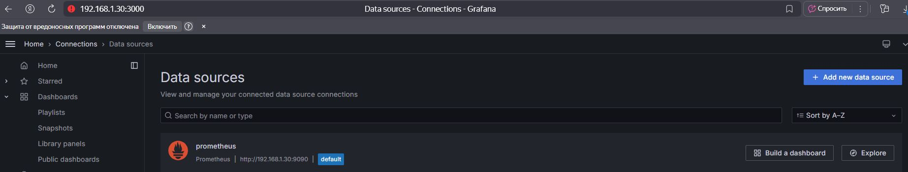
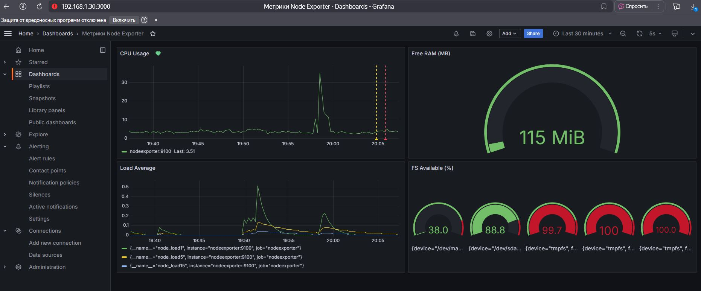
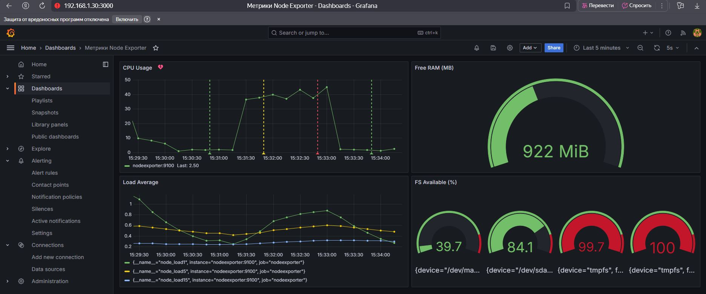
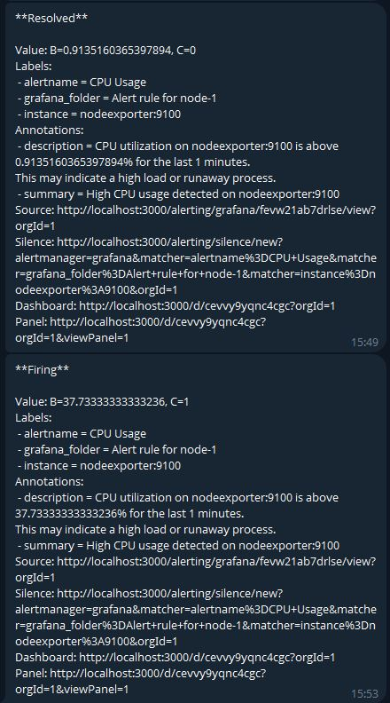

# Средство визуализации Grafana

## Задание 1

<center>

</center>

## Задание 2

- Утилизация CPU для nodeexporter (в процентах, 100-idle):
    ```promql
    100 - (avg by(instance) (irate(node_cpu_seconds_total{mode="idle"}[2m])) * 100)
    ```

- CPULA 1/5/15:
    ```promql
    node_load1
    node_load5
    node_load15
    ```

- Количество свободной оперативной памяти(MB):
    ```promql
    node_memory_MemFree_bytes / 1024 / 1024
    ```

- Количество места на файловой системе:
    ```promql
    (node_filesystem_avail_bytes / node_filesystem_size_bytes) * 100
    ```
<center>

</center>

## Задание 3

<center>

</center>

<center>

</center>

## Задание 4

JSON model дашборда [Метрики Node Exporter](https://github.com/alex-bel31/monitoring/blob/main/monitor-03-grafana/metricks-node-exporter.json)