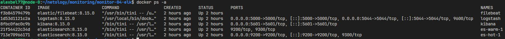
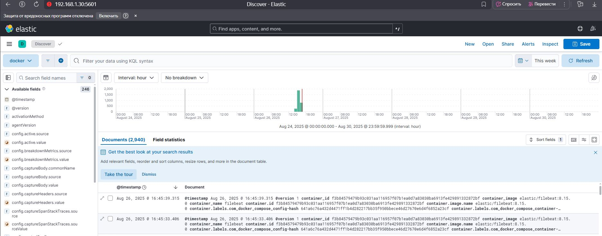

# Система сбора логов Elastic Stack

## Задание 1

- [docker-compose манифест](https://github.com/alex-bel31/monitoring/blob/main/monitor-04-elk/compose.yml)
- yml-конфигурации для стека([filebeat.yml](https://github.com/alex-bel31/monitoring/blob/main/monitor-04-elk/conf/filebeat.yml),[logstash.conf](https://github.com/alex-bel31/monitoring/blob/main/monitor-04-elk/conf/logstash.conf))

